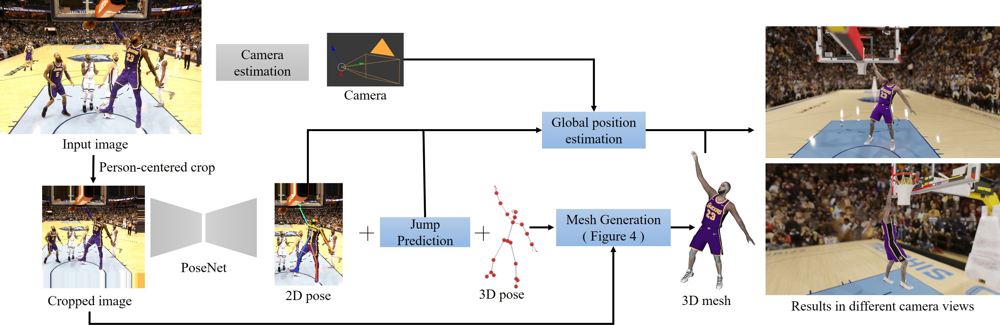

# Reconstructing NBA Players 
### [[Project Page]](http://grail.cs.washington.edu/projects/nba_players/) [[Paper]](https://arxiv.org/pdf/2007.13303.pdf) [[Dataset]](https://github.com/luyangzhu/NBA2K-dataset)
<div>

</div>

## Overview
This repository maintains the official implementation of our ECCV 2020 paper: 

**Reconstructing NBA Players**

By Luyang Zhu, Konstantinos Rematas, Brian Curless, Steve Seitz, Ira Kemelmacher-Shlizerman

## License
This work is licensed under [Creative Commons BY-NC-SA 4.0](https://creativecommons.org/licenses/by-nc-sa/4.0/).

## Installation
Please see [docs/INSTALL.md](docs/INSTALL.md)

## Full Pipeline Demo
Please see [docs/DEMO.md](docs/DEMO.md)

## Testing Mesh Generation Networks
Please see [docs/TEST.md](docs/TEST.md)

## Training Mesh Generation Networks
Please see [docs/TRAIN.md](docs/TRAIN.md)

## Citation
If you use this code for your research, please citing our [work](https://arxiv.org/pdf/2007.13303.pdf).

```latex
@InProceedings{zhu_2020_eccv_nba,
    author={Zhu, Luyang and Rematas, Konstantinos and Curless, Brian and Seitz, Steve and Kemelmacher-Shlizerman, Ira},
    title={Reconstructing NBA players},
    booktitle = {Proceedings of the European Conference on Computer Vision (ECCV)},
    month = {August},
    year={2020}
}
```