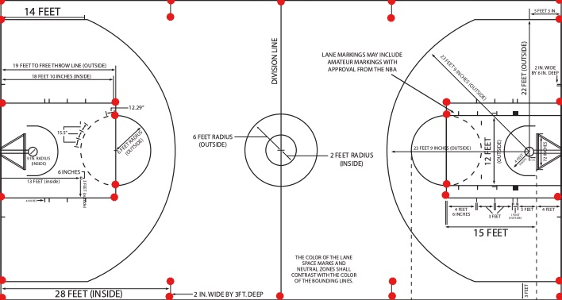
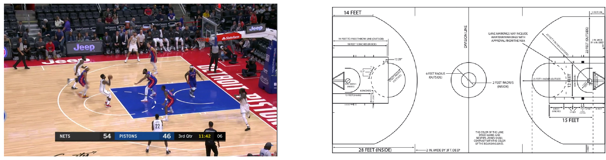
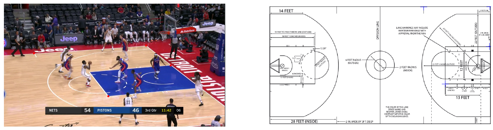
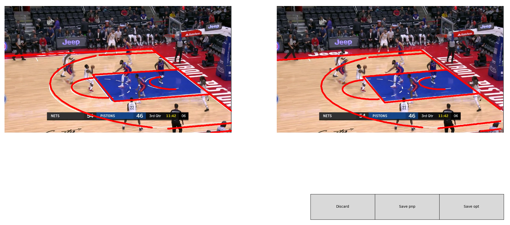
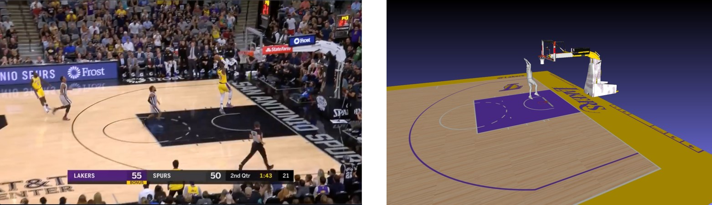

# Demo
We provde some [sample data](https://drive.google.com/file/d/1j-joJWioaF7JK_j-VrZUYSsE1iZxMKzz/view?usp=sharing) for you to run our demos. Please download and unzip it under the ${REPO_ROOT_FOLDER}. After that, you should see a 'data' folder under the ${REPO_ROOT_FOLDER}.

## Select your own images
You are also free to use your own images. Here are the requirements of selected images:
- The camera view should be very close to a live broadcast NBA game (close-up of players and camera view under the basket stand will fail). You can get desired images by capturing a screenshoot from NBA highlights in Youtube, for example, [this video](https://www.youtube.com/watch?v=YnPoW-IttS0). 
- The target player you want to reconstruct can not be occluded too much in the input image. Otherwise, OpenPose may fail to detect the target player and give wrong center crop image.
- The captured image should be arranged in the following folder structure: `${REPO_ROOT_FOLDER}/data/${capture_folder_name}/images/${capture_image_name}.png`. Please see our provided sample data for reference.
- There should be at least 4 corner points (3 corner points can not reside in the same line) of the court lines in the captured image. This is very important for global position estimation. The desired corner points are shown below (red dots):
<div>

</div>


## Preprocessing
If you use our provided sample data, you can skip this step as we already use OpenPose to get the center crop image of the target player. Otherwise, you need to change the `openpose_folder` and `openpose_path` in `preprocess/openpose.py` to where you installed OpenPose. You also need to change the `root_folder` in `preprocess/openpose.py` to the capture image folder. After that, run:
```
cd preprocess
python openpose.py
```
Since OpenPose detects all people in the current image, you need to delete all other center cropped images under `${REPO_ROOT_FOLDER}/data/${capture_folder_name}/img_crop/` and only keep the center crop of the target player.

## Image to mesh
### PoseNet
Change the following options in `img_to_mesh/src/experiments/pose/pose_demo.yaml`:
- `vis_gpu`: Set it as your CUDA_VISIBLE_DEVICES.
- `base_log_dir`: The root folder of the pose log folder. If you follow the instruction of downloading pretrained checkpoints, you don't need to change it.
- `log_name`: Name of the pose log folder. If you follow the instruction of downloading pretrained checkpoints, you don't need to change it.
- `demo.subdir`: The capture folder name.

Change the following line in `img_to_mesh/src/experiments/pose/pose_run.sh`:
```
cfg_path=experiments/pose/pose_demo.yaml
```
Run PoseNet forward pass:
```
cd img_to_mesh/src
bash experiments/pose/pose_run.sh
```
### Mesh generation network
Change the following options in `img_to_mesh/src/experiments/mesh/mesh_demo.yaml`:
- `data_root_dir`: Set it to the mesh_release dataset path on your machine. 
- `vis_gpu`: Set it as your CUDA_VISIBLE_DEVICES.
- `base_log_dir`: The root dir of the mesh log folder. If you follow the instruction of downloading pretrained checkpoints, you don't need to change it.
- `log_name`: Name of the mesh log folder. If you follow the instruction of downloading pretrained checkpoints, you don't need to change it.
- `demo.subdir`: The capture folder name.

Change the following line in `img_to_mesh/src/experiments/mesh/mesh_run.sh`:
```
cfg_path=experiments/mesh/mesh_demo.yaml
```
Run Mesh Generation forward pass:
```
cd img_to_mesh/src
bash experiments/mesh/mesh_run.sh
```
### Mesh penetration optimization (optional)
If you successfully build the torch-mesh-isect extension and find the generated mesh has body-garment penetraion. You can run the mesh_penetration optimization. First change the `obj_path` in `img_to_mesh/src/solve_pene.py` to your generated mesh path, which should located in `${REPO_ROOT_DIR}/results/${capture_folder_name}/objs/${crop_img_name}.obj`. Then run:
```
cd img_to_mesh/src
python solve_pene.py
```
**Note**: We find torch-mesh-isect only works at GPU 0. If you set CUDA_VISIBLE_DEVICES to other GPU, you may encounter "illegal cuda memory access" error.

## Global position
### Court line generation
Change the following options in `global_position/field_lines/src/experiments/demo.yaml`:
- `vis_gpu`: Set it as your CUDA_VISIBLE_DEVICES.
- `base_log_dir`: The root dir of the court lines log folder. If you follow the instruction of downloading pretrained checkpoints, you don't need to change it.
- `log_name`: Name of the court lines log folder. If you follow the instruction of downloading pretrained checkpoints, you don't need to change it.
- `demo.subdir`: The capture folder name.

Change the following line in `global_position/field_lines/src/experiments/run.sh`:
```
cfg_path=experiments/demo.yaml
```
Run field line generation forward pass:
```
cd global_position/field_lines/src
bash experiments/run.sh
```
### Camera calibration
**Make sure you are not running on headless server**. This step requires a monitor connected. 

Change `subdir` in `main()` function of `global_position/calibrate/calibrate.py` to the capture folder name. Run the code:
```
cd global_position/calibrate
python calibrate.py
```
It will pop up a window like this:
<div>

</div>

You need to click the correspondence point pairs in input image (left) and court line definition image (right). The clicked points are shown as **red dots** in the left and **blue cross** on the right. The **click sequence** is important, you should follow: left point 1, right point 1, left point 2, right point 2 ...... We found 4 point pairs is enough for solvePnP to work. You also need to make sure the 3 point in one image can not reside in the same line. Here is a sample annotation image:
<div>

</div>

After you finish clicking the point pairs, close the window. Then the algorithm will run line-based optimization and pop up a new window like this:
<div>

</div>

The left image is projected court lines using camera from manual annotation. The right image is projected court lines using camera after optimization. Based on the results, you can decide which camera to save: 'save pnp' button will store camera from manual annotation. 'save opt' button will store camera after optimization. If both are not accurate, you can click on 'Discard' button and rerun the code.

### Computing global position
Change `subdir` in `main()` function of `global_position/optimize_trajectory/optimize_single_frame.py` to the capture folder name. Run the code:
```
cd global_position/optimize_trajectory
python optimize_single_frame.py
```
**Note**: If you select a camera view different from the live broadcast view, you need to manually provide the rotation angle which transforms the live broadcast view to your image view by rotating around the axis perpendicular to the ground. The rotation angle is set in `aux_angle` parameter in `write_mesh()` function in `optimize_single_frame.py`. Since this might introduce large position errors, we highly discourage you to do that.

## Visualize results
The final mesh obj is stored in `${REPO_ROOT_FOLDER}/results/${capture_folder_name}/global_objs/${crop_img_name}.obj`. You can view it in MeshLab. To better visualize the global position, we also provide court mesh in sample_data.zip under `data/court/obj/`. you can load court.obj and stand.obj into MeshLab to view the final results. Here is a sample input and 3D reconstruction from sample_data/lbj_dunk (ignore the court texture difference):
<div>

</div>